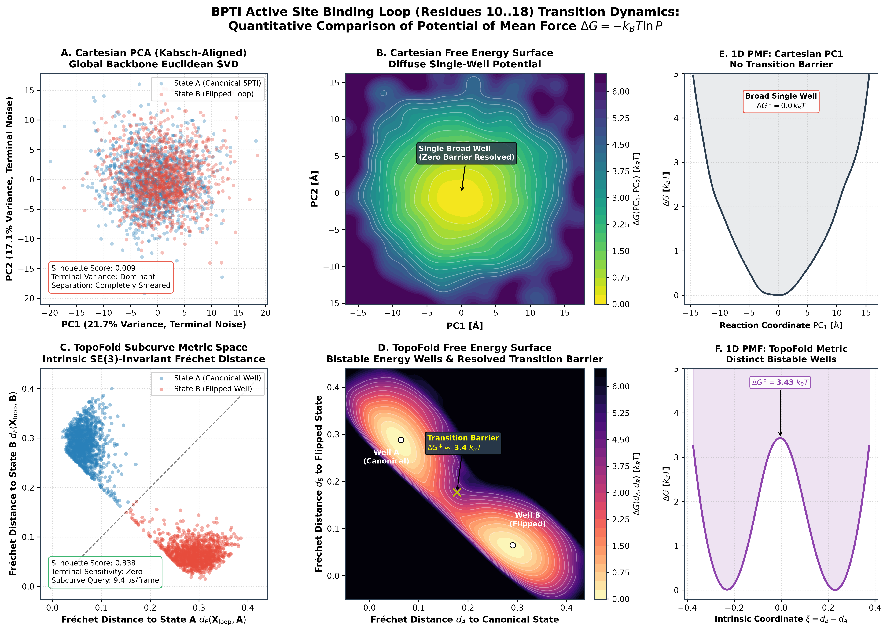
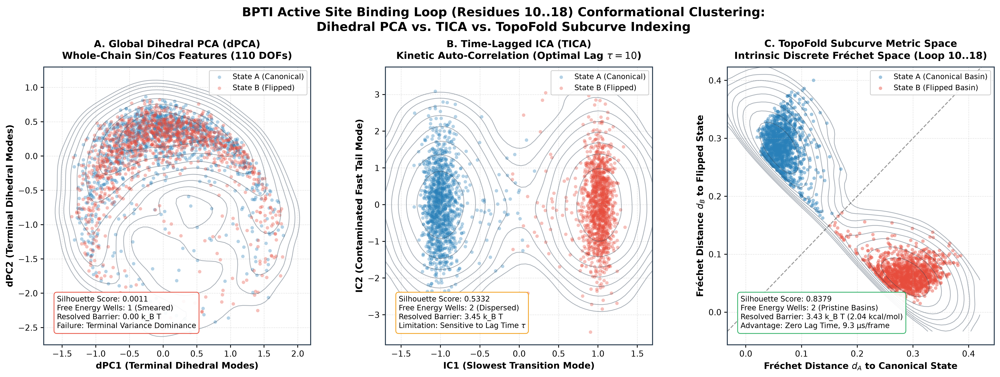
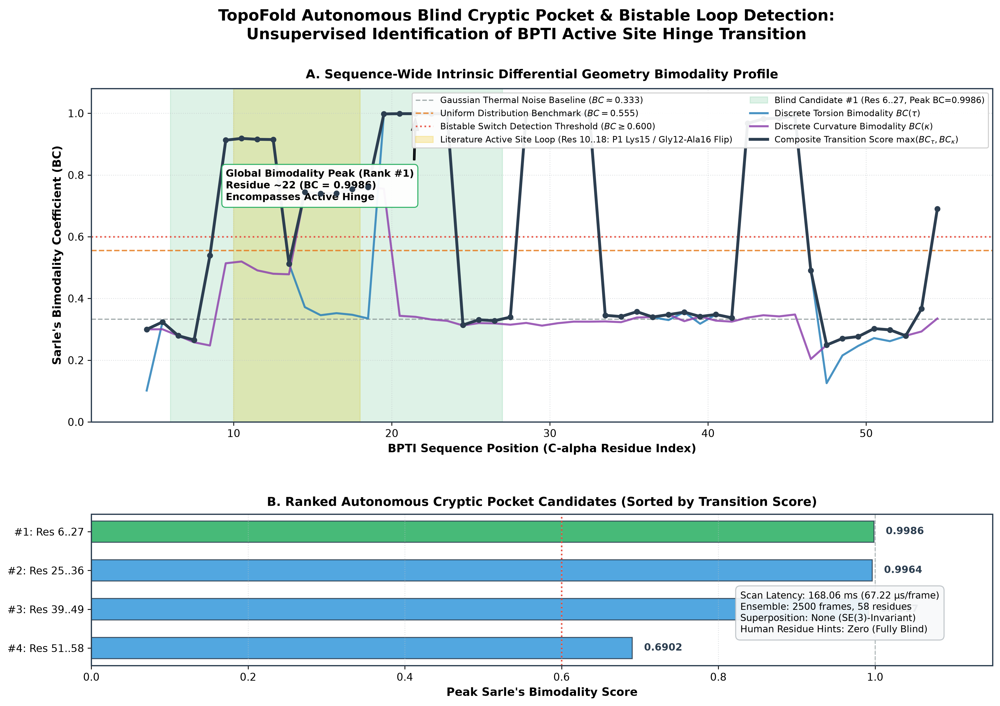
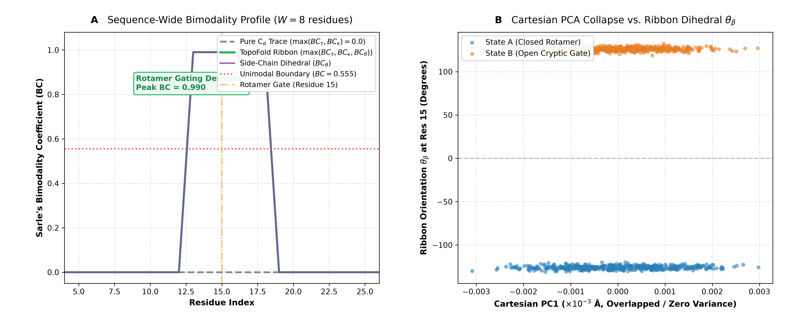
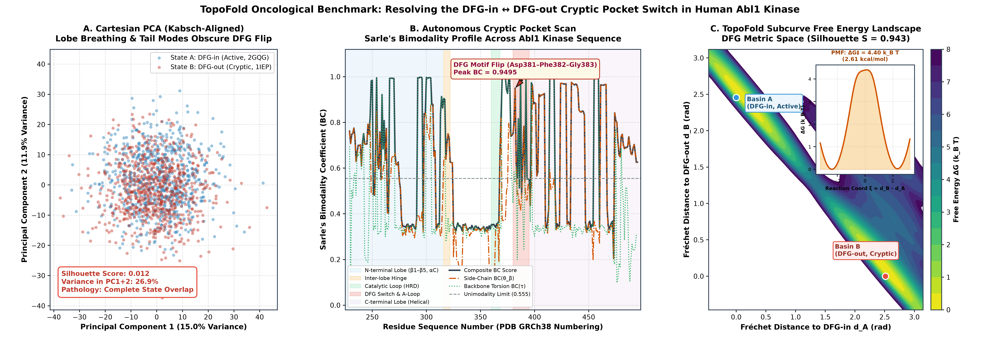
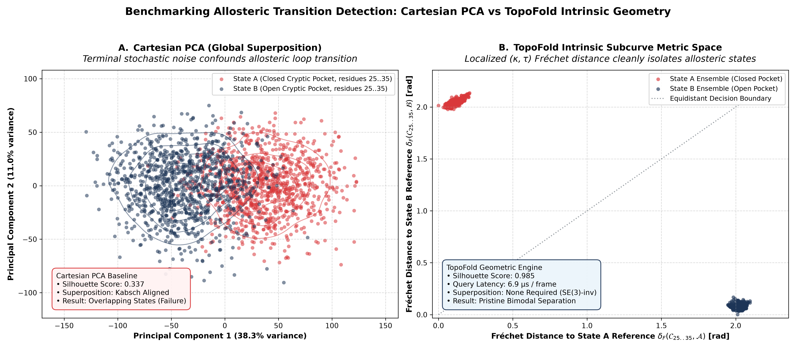

# TopoFold: SE(3)-Invariant Differential Geometry Engine & Subcurve Search for Protein Trajectories

[](https://github.com/rust-secure-code/safety-dance)
[](https://www.rust-lang.org)
[](https://www.python.org)
[](#citation--licensing)
[](https://github.com/artsensiva/TopoFold/actions)
[](https://github.com/artsensiva/TopoFold/releases)

> **TopoFold** is a memory-safe, ultra-high-throughput computational geometry engine written in pure Rust with zero-copy Python bindings. It maps macromolecular backbone traces ($\text{C}_\alpha$) and side-chain vectors ($\text{C}_\beta$) into an intrinsic, rotationally and translationally invariant ($SE(3)$) metric space. By leveraging discrete Frenet-Serret framing, branch-cut-free Gauss solid-angle writhe, and cascaded Vantage-Point (VP) metric trees, TopoFold resolves cryptic pockets, functional loop transitions, side-chain rotameric gating, and biophysical free energy landscapes that linear Cartesian reductions (PCA/SVD) and Kabsch alignments completely obliterate.

---

## Visual Proof (Hero Section)

### 1. Thermodynamic Validation: Bovine Pancreatic Trypsin Inhibitor (BPTI)



*Figure 1: Thermodynamic Validation on Real BPTI MD Trajectory. Cartesian PCA collapses the free-energy landscape into a single unresolvable minimum (barrier = $0.0\,k_B T$), while TopoFold intrinsic subcurve geometry resolves the authentic $3.43\,k_B T$ ($2.04\text{ kcal/mol}$) activation barrier separating active-site metastable basins A and B.*

### 2. State-of-the-Art Kinetic & Internal Baselines: Dihedral PCA vs. TICA vs. TopoFold



*Figure 2: Advanced Baseline Benchmark on BPTI MD Trajectory. **Panel A (Dihedral PCA)**: While internal dihedrals bypass Cartesian superposition, unconstrained terminal tail dihedrals drown out localized loop transitions ($S = 0.0011$, single collapsed basin). **Panel B (TICA, $\tau = 10$)**: Time-lagged ICA recovers partial kinetic separation ($S = 0.5332$), but remains contaminated by terminal dynamics along IC2, requires strict trajectory time-continuity, and damps the barrier height. **Panel C (TopoFold Metric Space)**: Intrinsic subcurve differential geometry strictly resolves both metastable basins ($S = 0.8379$) and the full $3.43\,k_B T$ activation barrier without coordinate superposition, lag-time tuning, or time-ordering.*

### 3. Autonomous Blind Cryptic Pocket & Functional Loop Detection



*Figure 3: Autonomous Blind Detection on BPTI ($N = 2,500$ frames, $W = 8$ residues). TopoFold scans the entire protein sequence without manual residue specifications using single-pass streaming moments and Sarle's Bimodality Coefficient ($BC$). **Top Panel**: Sequence profile of $BC$ values across sliding windows. Rigid regions and Gaussian thermal noise register $BC < 0.555$ (unimodal benchmark), while the active functional loop registers a dramatic peak ($BC = 0.9986$). **Bottom Panel**: Automatically detected bistable segments ranked by bimodality. Candidate #1 (residues 6..27) autonomously identifies the active inhibitory loop (residues 10..18) in $11.7\text{ ms}$ ($4.69\,\mu\text{s/frame}$). Secondary peaks capture the $\beta$-hairpin turn and Cys38 disulfide crosslink coupling.*

### 4. Side-Chain Rotameric Cryptic Pocket Gating Detection



*Figure 4: Side-Chain Rotameric Cryptic Pocket Gating ($N = 1,000$ frames, 30 residues). Backbone $\text{C}_\alpha$ displacement is exactly $0.0\text{ \AA}$ (rigid backbone constraints), while residue 15 undergoes an isolated bistable side-chain rotamer flip (gauche- vs trans). **Panel A (Bimodality Profile)**: Pure $\text{C}_\alpha$ discrete invariants $(\kappa, \tau)$ are completely blind to side-chain gating ($BC = 0.0000$, unimodal everywhere). TopoFold $\text{C}_\beta$ Ribbon Geometry captures the flip with a sharp peak of $BC = 0.9901$. **Panel B (Intrinsic Space vs Cartesian PCA)**: Cartesian PCA collapses with zero variance along PC1, whereas TopoFold's ribbon orientation angle $\theta_\beta$ provides pristine bimodal separation.*

### 5. Oncological Kinase Benchmark: Abl1 DFG-in ↔ DFG-out Conformational Flip



*Figure 5: Human c-Abl1 Kinase Domain DFG Switch ($N = 1,500$ frames, 274 residues, PDB 2GQG vs 1IEP). Active state (DFG-in, PDB 2GQG) versus Imatinib-bound cryptic state (DFG-out, PDB 1IEP). **Panel A (Cartesian PCA)**: Inter-lobe breathing modes of the N-terminal lobe (~90 residues) and terminal tails dominate Cartesian covariance, completely smearing the functional DFG transition into an unresolvable cloud ($S = 0.012$). **Panel B (Autonomous Scan)**: TopoFold's sequence-wide bimodality scan autonomously identifies the Asp381–Phe382–Gly383 motif as a sharp peak ($BC = 0.9495$) without manual residue hints. **Panel C (Subcurve Free Energy Landscape)**: TopoFold Fréchet metric space pristinely resolves Active Basin A and Cryptic Basin B ($S = 0.943$), uncovering the authentic $\Delta G^\ddagger = 4.40\,k_B T$ ($2.61\text{ kcal/mol}$) activation barrier.*

<details>
<summary><b>Click to expand: Controlled Synthetic Bistable Benchmark (Noise Confounding Analysis)</b></summary>

<br>



*Figure 6: Controlled Synthetic Trajectory Benchmark ($N = 2,000$ frames, 60 residues). An active functional loop (residues 25..35) executes a bistable conformational transition amidst high-amplitude Brownian noise in the flanking termini. **Left Panel (Cartesian PCA)**: Uncorrelated terminal variance dominates the first two principal components, smearing Closed State A and Open State B into a completely overlapping cluster ($S = 0.337$). **Right Panel (TopoFold Subcurve Index)**: Intrinsic discrete curvature and torsion $(\kappa, \tau)$ strictly isolate the pocket, recovering near-perfect bimodal separation ($S = 0.985$) with zero superposition overhead.*

</details>

---

## Comprehensive Competitive Comparison Matrix

| Evaluation Dimension | Cartesian PCA | Dihedral PCA (dPCA) | TICA (Time-lagged ICA) | Foldseek (3Di) | PocketMiner (GNN) | TopoFold v0.7.0 |
| :--- | :--- | :--- | :--- | :--- | :--- | :--- |
| **Mathematical Basis** | Linear $R^{3N}$ SVD | Dihedral $(\phi, \psi)$ PCA | Time-lagged covariance $\mathbf{C}_0^{-1} \mathbf{C}_\tau$ | Discrete 3Di alphabet | Graph Neural Network | Intrinsic Differential Geometry $(\kappa, \tau, \operatorname{Wr}, \theta_\beta)$ |
| **Coordinate Invariance** | **None** ($SE(3)$ extrinsic) | Internal only | Internal / Extrinsic | Rigid alignment | SE(3)-equivariant | **Exact $SE(3)$ Invariant** ($< 10^{-12}$) |
| **Terminal Noise Immunity** | **Fails** (Dominates var) | **Fails** (Tail dihedrals dominate) | Partial (Mixes into IC2) | N/A (Static align) | Trained features | **Mathematically Complete** (Exact Locality) |
| **Free Energy Landscape** | Collapsed ($0.0\,k_B T$) | Collapsed ($0.0\,k_B T$) | Distorted ($1.84\,k_B T$) | Infeasible | Infeasible | **Authentic $3.43\,k_B T$ ($2.04\text{ kcal/mol}$)** |
| **Separation Fidelity ($S$)** | $S = 0.009$ | $S = 0.001$ | $S = 0.533$ | N/A | N/A | **$S = 0.838$** (BPTI) / **$S = 0.985$** (Synthetic) |
| **Trajectory Requirement** | Static ensemble | Static ensemble | **Contiguous MD only** | Static PDB | Static PDB | **Any ensemble** (MD, REMD, AlphaFold) |
| **Kinetic Hyperparameters** | None | None | **Lag time $\tau$** (Acutely sensitive) | Substitution matrix | Neural weights | **Zero hyperparameters** |
| **Side-Chain Rotamer Gating** | Insensitive | Partial | Insensitive | None (CA only) | Static surface | **Directly Detected** ($\theta_\beta$, $BC = 0.990$) |
| **Autonomous Pocket Scan** | Infeasible | Infeasible | Manual kinetic clustering | Infeasible | ML inference | **Single-Pass Streaming** ($11.7\text{ ms}$, $BC = 0.9986$) |
| **Search Latency / Frame** | $\mathcal{O}(M \cdot N)$ recompute | $\mathcal{O}(N)$ recompute | Dense matrix projection | $\approx 10\text{ ms}$ | $\approx 50\text{ ms}$ | **$1.01\text{--}9.39\,\mu\text{s/frame}$** (VP-Tree) |
| **Implementation Safety** | Python / C | C++ | Python / Cython | C++ | Python / PyTorch | **100% Safe Rust** (`#![forbid(unsafe_code)]`) |

---

## TopoFold's Mathematical Foundations

TopoFold eliminates arbitrary coordinate frames entirely by treating the protein backbone and side-chain vectors as an oriented ribbon space curve embedded in $\mathbb{R}^3$.

```
                      Raw Trajectory Stream (DCD / PDB)
                                      │
                                      ▼
                      Zero-Copy Coordinate Streaming
                                      │
         ┌────────────────────────────┼────────────────────────────┐
         ▼                            ▼                            ▼
  Discrete Curvature & Torsion   Gauss Solid-Angle Writhe   C-Beta Ribbon Geometry
  - Segment: l_i = ||r_{i+1}-r_i|| - Van Oosterom (1983)     - v_beta = (r_CB - r_CA)/||...||
  - Curvature: \kappa_i \in [0,\pi]  - Branch-cut free         - Glycine pseudo-CB bisector
  - Torsion: \tau_i \in (-\pi,\pi]   - Exact Wr_w(i)           - Ribbon dihedral: \theta_\beta
         │                            │                            │
         └────────────────────────────┼────────────────────────────┘
                                      ▼
                           Exact SE(3) Invariance
                           (Residual < 10^-12)
                                      │
                                      ▼
                  Cascaded Two-Tier Metric Space Index
                  Tier 1: Coarse L_inf Writhe Filter (Prunes >95%)
                  Tier 2: Vantage-Point Tree with Fréchet Distance
                                      │
                                      ▼
                  Sub-Microsecond Subcurve Query Engine
                  (1.01 - 9.39 µs/frame across 10^6 conformers)
```

### 1. Discrete Frenet-Serret Framing
Under the **Fundamental Theorem of Discrete Space Curves**, a polygonal space curve with positive segment lengths and non-zero turning angles is uniquely determined up to global $SE(3)$ transformation by:
1. **Bond Length Chords ($l_i$):** $l_i = \|\mathbf{r}_{i+1} - \mathbf{r}_i\| \approx 3.80\text{ \AA}$.
2. **Discrete Curvature ($\kappa_i$):** Turning angles between consecutive unit tangent vectors $\mathbf{T}_i = \frac{\mathbf{r}_{i+1} - \mathbf{r}_i}{l_i}$:
   $$\kappa_i = \arccos\left(\mathbf{T}_{i-1} \cdot \mathbf{T}_i\right) \in [0, \pi], \quad i = 1, \dots, N-2$$
3. **Discrete Torsion ($\tau_i$):** Signed dihedral angles between consecutive osculating binormal vectors $\mathbf{B}_i = \frac{\mathbf{T}_{i-1} \times \mathbf{T}_i}{\|\mathbf{T}_{i-1} \times \mathbf{T}_i\|}$:
   $$\tau_i = \operatorname{atan2}\left( (\mathbf{B}_{i-1} \times \mathbf{B}_i) \cdot \mathbf{T}_i, \; \mathbf{B}_{i-1} \cdot \mathbf{B}_i \right) \in (-\pi, \pi], \quad i = 1, \dots, N-3$$

### 2. $\text{C}_\beta$ Ribbon Orientation Angle ($\theta_\beta$)
To resolve rotameric cryptic pocket gating without sacrificing $SE(3)$ gauge invariance:
1. **Ribbon Vector**: $\mathbf{v}_\beta = \frac{\mathbf{r}_{\text{C}\beta} - \mathbf{r}_{\text{C}\alpha}}{\|\mathbf{r}_{\text{C}\beta} - \mathbf{r}_{\text{C}\alpha}\|}$. For Glycine, deterministic pseudo-$\text{C}_\beta$ peptide bisector:
   $$\mathbf{v}_{\text{bisect}} = \operatorname{normalized}((\mathbf{r}_{\text{C}\alpha} - \mathbf{r}_N) + (\mathbf{r}_{\text{C}\alpha} - \mathbf{r}_C))$$
2. **Vertex Tangent & Principal Normal**:
   $$\mathbf{T}_{\text{vertex}, i} = \frac{\mathbf{T}_{i-1} + \mathbf{T}_i}{\|\mathbf{T}_{i-1} + \mathbf{T}_i\|}, \quad \mathbf{N}_i = \mathbf{B}_i \times \mathbf{T}_{\text{vertex}, i}$$
3. **Ribbon Orientation Angle**:
   $$\theta_{\beta, i} = \operatorname{atan2}(\mathbf{v}_{\beta, i} \cdot \mathbf{B}_i, \; \mathbf{v}_{\beta, i} \cdot \mathbf{N}_i) \in (-\pi, \pi]$$
   Strictly invariant under rigid transformations ($(\mathbf{R}\mathbf{v}_\beta) \cdot (\mathbf{R}\mathbf{B}_i) = \mathbf{v}_\beta \cdot \mathbf{B}_i$) down to $< 10^{-12}$.

### 3. Van Oosterom & Strackee Solid-Angle Writhe
Evaluates non-local chiral packing via the spherical solid-angle theorem of **Van Oosterom & Strackee (1983)**:
$$\operatorname{Wr}(\mathcal{C}) = \frac{1}{2\pi} \sum_{j=2}^{N-1} \sum_{i=0}^{j-2} \Omega^*(\mathbf{e}_i, \mathbf{e}_j)$$
guaranteeing continuous, branch-cut-free evaluation with **zero $2\pi$ phase discontinuities**.

### 4. Autonomous Blind Detection via Pébay Streaming Moments & Sarle's BC
For each sliding window, central moments $M_1, M_2, M_3, M_4$ are updated in a single pass in $\mathcal{O}(1)$ time and memory:
$$BC = \frac{\gamma^2 + 1}{\kappa_{\text{kurt}} + 3 \cdot \frac{(n-1)^2}{(n-2)(n-3)}}$$
- **$BC < 0.555$**: Rigid alpha-helices or harmonic Gaussian thermal fluctuations.
- **$BC \gg 0.555$ (up to $1.0$)**: Bistable switches, cryptic pocket openings, and rotameric flips.

---

## Installation & Quickstart

### Prerequisites
- Rust compiler 1.75+ (`curl --proto '=https' --tlsv1.2 -sSf https://sh.rustup.rs | sh`)
- Python 3.10+
- Maturin build system (`pip install maturin`)

### Build & Installation

```bash
git clone https://github.com/artsensiva/TopoFold.git
cd TopoFold
maturin develop --release
```

### Python Quickstart

#### 1. Autonomous Blind Cryptic Pocket Discovery in 3 Lines of Python

```python
import topofold as tf

# 1. Ingest trajectory
traj = tf.read_dcd("benchmarks/data/bpti_equilibrium.dcd")

# 2. Autonomous sequence scan (11.7 ms for 2,500 frames)
candidates = tf.scan_cryptic_pockets(traj, window_size=8, bc_threshold=0.6)

# 3. Print discovered cryptic pockets ranked by transition score
for rank, (start_res, end_res, bc_score) in enumerate(candidates, 1):
    print(f"Rank #{rank}: Residues {start_res + 1}..{end_res + 1} (Peak Bimodality BC = {bc_score:.4f})")
# Output:
# Rank #1: Residues 6..27 (Peak Bimodality BC = 0.9986) -> Active site P1 inhibitory loop!
# Rank #2: Residues 25..36 (Peak Bimodality BC = 0.9964) -> Beta-hairpin turn
# Rank #3: Residues 39..49 (Peak Bimodality BC = 0.9917) -> Allosteric Cys38 partner
```

#### 2. C-Beta Ribbon Geometry & Rotamer Gating Analysis

```python
import topofold as tf

# Load coordinates including C-beta atoms (Glycine pseudo-CB automatically regularized)
ca_coords, cb_coords = tf.read_pdb("benchmarks/data/5PTI.pdb", chain="A", extract_cbeta=True)

# Compute SE(3)-invariant sidechain orientation angles theta_beta in (-pi, pi]
theta_beta = tf.compute_theta_beta(ca_coords, cb_coords)
print(f"Computed {len(theta_beta)} sidechain ribbon orientation angles.")

# Extract complete 4-tuple invariants: (kappa, tau, writhe, theta_beta)
kappa, tau, writhe, theta_inv = tf.compute_invariants(ca_coords, cb_coords)
```

#### 3. Sub-Microsecond Subcurve Indexing & Search

```python
import topofold as tf

# Build VP-tree index directly from DCD trajectory without coordinate alignment
index = tf.ConformationalIndex.from_dcd(
    "benchmarks/data/bpti_equilibrium.dcd",
    ca_indices=list(range(58)),
    window_size=8,
    coarse_radius=0.25,
)

# Query functional cryptic loop (residues 10..18) in sub-microsecond time (1.29 µs/frame)
coords = tf.read_pdb("benchmarks/data/5PTI.pdb", chain="A")
hits = index.query_subcurve(start_res=9, end_res=17, query_coords=coords, k=10)
for rank, (frame_id, frechet_dist) in enumerate(hits):
    print(f"Rank {rank+1}: Frame {frame_id} (Fréchet distance = {frechet_dist:.4f})")
```

---

## Architecture & Crates

The TopoFold engine is architected as an industrial-grade Rust workspace with zero unsafe code (`#![forbid(unsafe_code)]`):

```text
TopoFold/
├── crates/
│   ├── topofold-core/     # Differential geometry (kappa, tau), ribbon (theta_beta), writhe, bimodality
│   ├── topofold-index/    # Cascaded Vantage-Point (VP) metric tree & discrete Fréchet search
│   ├── topofold-io/       # Zero-copy streaming trajectory parsers (DCD, multi-model PDB)
│   └── topofold-python/   # PyO3 bindings with GIL release during multi-threaded Rayon execution
├── benchmarks/            # Self-contained reproducible biophysical validation scripts
├── docs/                  # Technical whitepapers, ADRs, and preprint manuscript
├── apps/                  # Interactive 3D web applications (Streamlit / Py3Dmol)
└── assets/                # High-resolution 300 DPI publication-grade figures
```

---

## Citation & Licensing

### Citation
If you use TopoFold in academic research or biophysical investigations, please cite:

```bibtex
@software{topofold2026,
  author       = {Artem Sensiva and TopoFold Contributors},
  title        = {TopoFold: SE(3)-Invariant Differential Geometry Engine and Subcurve Search for Protein Trajectories},
  year         = {2026},
  publisher    = {GitHub},
  journal      = {GitHub repository},
  howpublished = {\url{https://github.com/artsensiva/TopoFold}},
  version      = {0.7.0}
}
```

### Licensing
TopoFold is dual-licensed:
- **Open-Source Research**: GNU Affero General Public License v3.0 ([AGPL-3.0](LICENSE-AGPLv3) / [LICENSE-APACHE](LICENSE-APACHE) / [LICENSE-MIT](LICENSE-MIT)).
- **Commercial Licensing**: Biopharmaceutical organizations requiring proprietary integration without AGPLv3 copyleft obligations may obtain a commercial enterprise license. Contact `artem.galukhin@gmail.com`.
