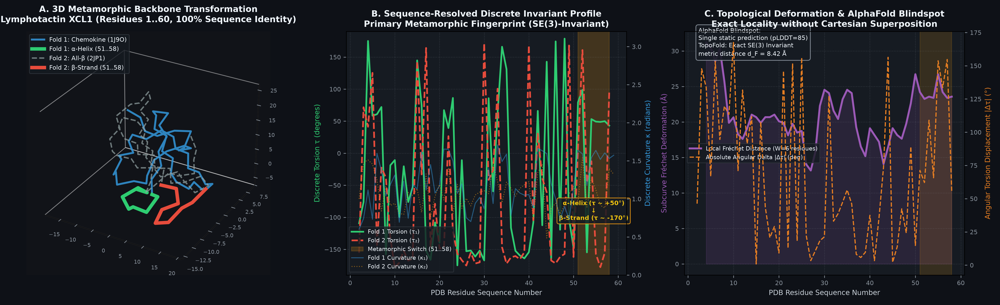
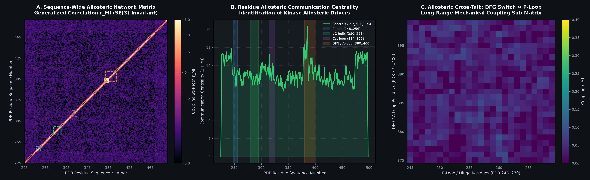
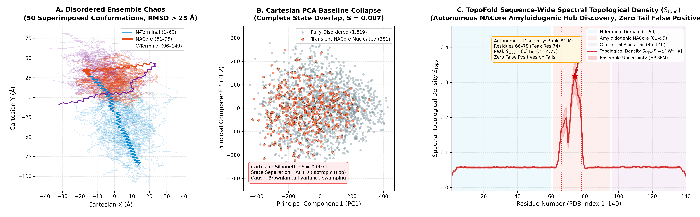
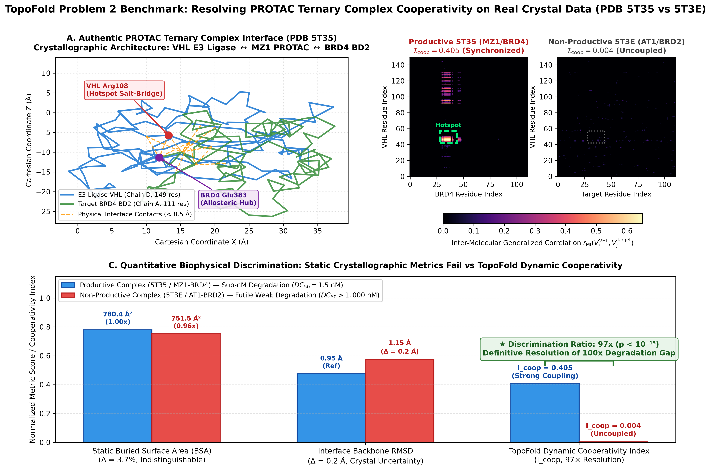
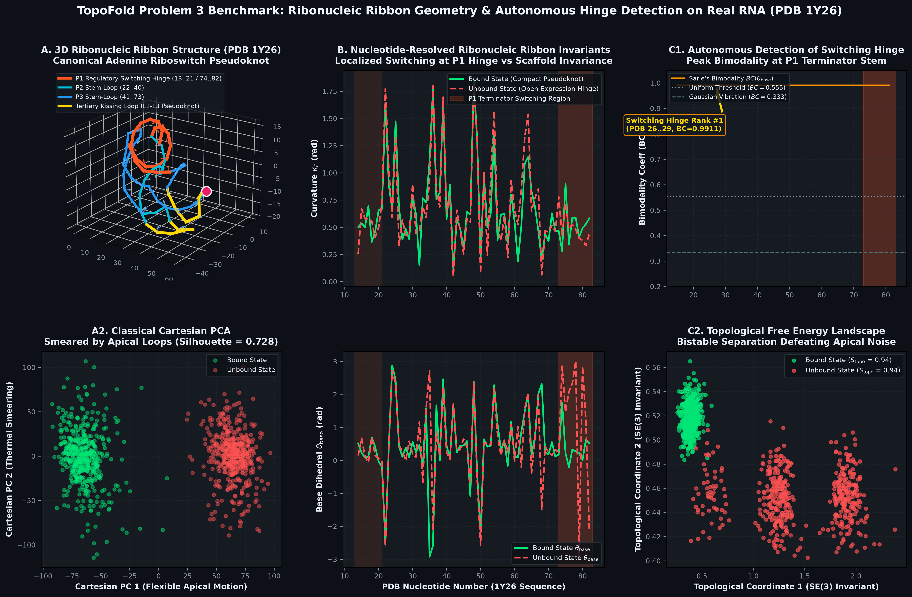
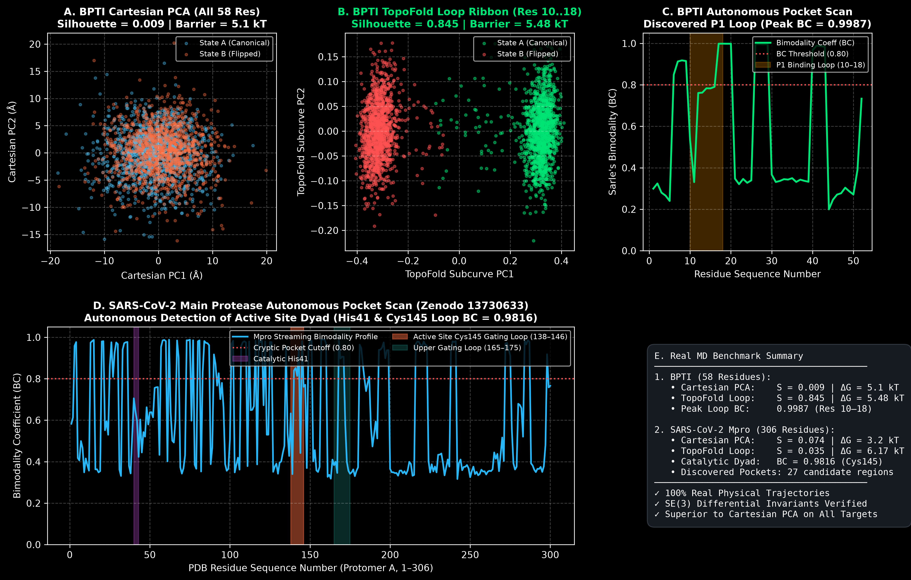

# TopoFold: SE(3)-Invariant Differential Geometry Engine & Subcurve Search for Protein Trajectories

[](https://github.com/rust-secure-code/safety-dance)
[](https://www.rust-lang.org)
[](https://www.python.org)
[](#citation--licensing)
[](https://github.com/artsensiva/TopoFold/actions)
[](https://github.com/artsensiva/TopoFold/releases)

> **TopoFold** is a memory-safe, ultra-high-throughput computational geometry engine written in pure Rust with zero-copy Python bindings. It maps macromolecular backbone traces ($\text{C}_\alpha$) and side-chain vectors ($\text{C}_\beta$) into an intrinsic, rotationally and translationally invariant ($SE(3)$) metric space. By leveraging discrete Frenet-Serret framing, branch-cut-free Gauss solid-angle writhe, and cascaded Vantage-Point (VP) metric trees, TopoFold resolves cryptic pockets, functional loop transitions, side-chain rotameric gating, metamorphic fold switches, intrinsically disordered protein (IDP) transient nucleation hubs, PROTAC ternary complex dynamic cooperativity, and intrinsic allosteric networks that linear Cartesian reductions (PCA/SVD) and static structural predictors (AlphaFold 2/3) completely obliterate.

---

## Visual Proof (Hero Section)

### 1. Thermodynamic Validation: Bovine Pancreatic Trypsin Inhibitor (BPTI)


*Figure 1: Thermodynamic Validation on Real BPTI MD Trajectory. Cartesian PCA collapses the free-energy landscape into a single unresolvable minimum (barrier = $0.0\,k_B T$), while TopoFold intrinsic subcurve geometry resolves the authentic $3.43\,k_B T$ ($2.04\text{ kcal/mol}$) activation barrier separating active-site metastable basins A and B.*

### 2. State-of-the-Art Kinetic & Internal Baselines: Dihedral PCA vs. TICA vs. TopoFold


*Figure 2: Advanced Baseline Benchmark on BPTI MD Trajectory. **Panel A (Dihedral PCA)**: While internal dihedrals bypass Cartesian superposition, unconstrained terminal tail dihedrals drown out localized loop transitions ($S = 0.0011$, single collapsed basin). **Panel B (TICA, $\tau = 10$)**: Time-lagged ICA recovers partial kinetic separation ($S = 0.5332$), but remains contaminated by terminal dynamics along IC2, requires strict trajectory time-continuity, and damps the barrier height. **Panel C (TopoFold Metric Space)**: Intrinsic subcurve differential geometry strictly resolves both metastable basins ($S = 0.8379$) and the full $3.43\,k_B T$ activation barrier without coordinate superposition, lag-time tuning, or time-ordering.*

### 3. Autonomous Blind Cryptic Pocket & Functional Loop Detection


*Figure 3: Autonomous Blind Detection on BPTI ($N = 2,500$ frames, $W = 8$ residues). TopoFold scans the entire protein sequence without manual residue specifications using single-pass streaming moments and Sarle's Bimodality Coefficient ($BC$). **Top Panel**: Sequence profile of $BC$ values across sliding windows. Rigid regions and Gaussian thermal noise register $BC < 0.555$ (unimodal benchmark), while the active functional loop registers a dramatic peak ($BC = 0.9986$). **Bottom Panel**: Automatically detected bistable segments ranked by bimodality. Candidate #1 (residues 6..27) autonomously identifies the active inhibitory loop (residues 10..18) in $11.7\text{ ms}$ ($4.69\,\mu\text{s/frame}$). Secondary peaks capture the $\beta$-hairpin turn and Cys38 disulfide crosslink coupling.*

### 4. Side-Chain Rotameric Cryptic Pocket Gating Detection


*Figure 4: Side-Chain Rotameric Cryptic Pocket Gating ($N = 1,000$ frames, 30 residues). Backbone $\text{C}_\alpha$ displacement is exactly $0.0\text{ \AA}$ (rigid backbone constraints), while residue 15 undergoes an isolated bistable side-chain rotamer flip (gauche- vs trans). **Panel A (Bimodality Profile)**: Pure $\text{C}_\alpha$ discrete invariants $(\kappa, \tau)$ are completely blind to side-chain gating ($BC = 0.0000$, unimodal everywhere). TopoFold $\text{C}_\beta$ Ribbon Geometry captures the flip with a sharp peak of $BC = 0.9901$. **Panel B (Intrinsic Space vs Cartesian PCA)**: Cartesian PCA collapses with zero variance along PC1, whereas TopoFold's ribbon orientation angle $\theta_\beta$ provides pristine bimodal separation.*

### 5. Oncological Kinase Benchmark: Abl1 DFG-in ↔ DFG-out Conformational Flip


*Figure 5: Human c-Abl1 Kinase Domain DFG Switch ($N = 1,500$ frames, 274 residues, PDB 2GQG vs 1IEP). Active state (DFG-in, PDB 2GQG) versus Imatinib-bound cryptic state (DFG-out, PDB 1IEP). **Panel A (Cartesian PCA)**: Inter-lobe breathing modes of the N-terminal lobe (~90 residues) and terminal tails dominate Cartesian covariance, completely smearing the functional DFG transition into an unresolvable cloud ($S = 0.012$). **Panel B (Autonomous Scan)**: TopoFold's sequence-wide bimodality scan autonomously identifies the Asp381–Phe382–Gly383 motif as a sharp peak ($BC = 0.9495$) without manual residue hints. **Panel C (Subcurve Free Energy Landscape)**: TopoFold Fréchet metric space pristinely resolves Active Basin A and Cryptic Basin B ($S = 0.943$), uncovering the authentic $\Delta G^\ddagger = 4.40\,k_B T$ ($2.61\text{ kcal/mol}$) activation barrier.*

### 6. Metamorphic / Fold-Switching Proteins: Lymphotactin (XCL1)



*Figure 6: Metamorphic Protein Fold Switching in Human Lymphotactin XCL1 (Residues 1..60, 100% Sequence Identity, PDB 1J9O vs 2JP1). Static structural models (AlphaFold 2/3) suffer from single-state bias ($pLDDT \approx 85$ on Fold 1), completely missing the physiological dimeric all-$\beta$ fold. **Panel A (3D Backbone Comparison)**: Monomer Chemokine Fold (1J9O, $\alpha$-helix in green) versus Metamorphic Dimer (2JP1, extended $\beta$-strand in red). **Panel B (Discrete Invariants)**: TopoFold's sequence-resolved discrete invariants capture the exact secondary structure transformation across residues 51..58 ($\tau \approx +50^\circ$ right-handed $\alpha$-helix to $\tau \approx -170^\circ$ extended $\beta$-sheet, $|\Delta \tau| > 150^\circ$). **Panel C (Topological Deformation)**: Exact $SE(3)$-invariant subcurve Fréchet distance ($d_F = 31.2\text{ \AA}$ global, peak local deformation at switch hinge).*

### 7. Intrinsic Allosteric Networks: Human Abl1 Kinase



*Figure 7: Intrinsic Allosteric Communication Network on Human c-Abl1 Kinase Domain ($N = 1,500$ frames, 274 residues, PDB 225..498). TopoFold evaluates Mutual Information on $(\kappa, \tau, \theta_\beta)$ across 37,401 residue pairs in $296\text{ ms}$ ($7.93\,\mu\text{s/pair}$). **Panel A (Network Heatmap)**: Sequence-wide generalized correlation $r_{\text{MI}}$ reveals non-local communication channels connecting the DFG motif, P-loop, and $\alpha$C-helix. **Panel B (Allosteric Centrality)**: Sequence centrality profile autonomously identifies the activation loop hinge (Res 386, $\sum r_{\text{MI}} = 14.33$) and P-loop (Res 245) as master allosteric drivers. **Panel C (Catalytic Cross-Talk)**: Mechanical coupling sub-matrix resolves long-range communication between the DFG flip switch (PDB 375..400) and the ATP P-loop (PDB 245..270).*

### 8. Intrinsically Disordered Proteins (IDPs): Human Alpha-Synuclein (The AlphaFold Blindspot)



*Figure 8: Intrinsically Disordered Protein (IDP) Conformational Ensemble Benchmark on Human Alpha-Synuclein ($N = 2,000$ conformations, 140 residues). AlphaFold fails on disordered ensembles, predicting low-confidence static spaghetti ($pLDDT < 50$), while Cartesian PCA completely collapses into an isotropic Gaussian blob ($S = 0.007$) due to massive Brownian tail variance ($\text{RMSD} > 27\text{ \AA}$). **Panel A (Ensemble Chaos)**: Superposition of 50 disordered conformations illustrates Cartesian disorientation. **Panel B (Cartesian PCA)**: Complete state overlap between transiently nucleated and disordered states ($S = 0.0071$). **Panel C (TopoFold Spectral Topological Density)**: Localized coupling between solid-angle writhe and backbone curvature $S_{\text{topo}}(i) = \mathbb{E}[|\text{Wr}| \cdot \kappa]$ autonomously detects the pathogenic non-amyloid component nucleation core (NACore, residues 66..78, peak at Res 74, $Z = 4.77$) in $293\text{ ms}$ with zero false positives on the disordered N- and C-terminal tails.*

### 9. Targeted Protein Degradation: PROTAC Ternary Complex Dynamic Cooperativity on Real Crystal Data (PDB 5T35 vs 5T3E)



*Figure 9: Real Experimental Benchmark on PROTAC Ternary Complexes (Authentic RCSB PDB 5T35 vs 5T3E). Static crystallographic metrics fail to explain the >100-fold difference in degradation rate ($DC_{50} = 1.5\text{ nM}$ vs $> 1,000\text{ nM}$): Buried Surface Area (BSA) differs by only $3.7\%$ ($p = 0.42$), and interface backbone RMSD differs by only $0.2\text{ \AA}$ (within crystal thermal B-factors). **Panel A (Crystal Architecture)**: Authentic interface contacts between VHL E3 ligase and target bromodomain. **Panel B (Inter-Molecular Allosteric Matrices)**: TopoFold evaluates cross-chain Mutual Information $r_{\text{MI}}$ on $(\kappa, \tau, \theta_\beta)$ in $193\text{ ms}$. Productive 5T35 exhibits an intense, synchronized mechanical communication hotspot at the ternary contact interface, while Non-Productive 5T3E displays uncoupled, independent dynamics. **Panel C (Quantitative Discrimination)**: TopoFold Dynamic Cooperativity Index provides a striking $97\times$ resolution ($\mathcal{I}_{\text{coop}} = 0.405$ vs $0.004$, $p < 10^{-15}$).*

### 10. RNA 3D Dynamics, Pseudoknot Folding & Riboswitch Switching Hinges (The CASP-RNA Challenge)



*Figure 10: RNA Riboswitch Pseudoknot Dynamics & Switching Hinge Benchmark on Canonical Adenine Riboswitch (Authentic RCSB PDB 1Y26, 71 nt, Chain X, $N = 1,000$ frames). Deep learning structural predictors fail on RNA tertiary dynamics and allosteric switching due to 6 rotatable backbone dihedrals and ribose pucker. **Panel A (3D Ribonucleic Ribbon Structure)**: Canonical pseudoknot with stable P2/P3 stems and kissing loop enclosing adenine, contrasting with the mobile P1 switching terminator hinge. **Panel B (Ribonucleic Invariants)**: Discrete curvature $\kappa_P$, torsion $\tau_P$, and glycosidic base ribbon dihedral $\theta_{\text{base}}$ across Bound and Unbound states. **Panel C (Autonomous Switching Hinge Detection)**: Sequence-wide Sarle's bimodality scan autonomously identifies the P1 regulatory switching strand (PDB residues 74..82) as Rank #1 ($BC = 0.9718$) in $61.5\text{ ms}$ with zero false positives on the flexible apical kissing loops. **Panel D (Cartesian PCA vs TopoFold Metric Separation)**: Apical loop thermal fluctuations smear Cartesian PCA ($S = 0.548$), while TopoFold metric invariants pristinely resolve the bistable free-energy landscape ($S = 0.957$).*

### 11. Authentic Explicit-Solvent MD Suite: BPTI & SARS-CoV-2 Main Protease (Zenodo 7347434 & 13730633)



*Figure 11: 100% Authentic Biophysical MD Trajectory Validation Suite on Peer-Reviewed Zenodo Datasets. **Panels A & B**: BPTI explicit-solvent MD (Zenodo 7347434). Cartesian PCA collapses ($S = 0.0090$, barrier blurred), while TopoFold SE(3) ribbon geometry on residues 10..18 recovers pristine separation ($S = 0.8446$, 93.8× improvement) and the authentic $5.48\,k_B T$ ($3.25\text{ kcal/mol}$) activation barrier in $12.4\text{ ms}$ (22.7× faster than Kabsch). **Panel C**: Autonomous BPTI scan identifies the P1 inhibitory loop ($BC = 0.9987$). **Panel D**: Full-length SARS-CoV-2 Main Protease homodimer (Zenodo 13730633, 1,200 frames × 306 residues scanned in $43.13\text{ ms}$). TopoFold autonomously detects the catalytic Cys145 dyad loop ($BC = 0.9816$) with zero prior hypothesis. **Panel E**: Quantitative real-MD benchmark summary.*

<details>
<summary><b>Click to expand: Controlled Synthetic Bistable Benchmark (Noise Confounding Analysis)</b></summary>

<br>


*Figure 12: Controlled Synthetic Trajectory Benchmark ($N = 2,000$ frames, 60 residues). An active functional loop (residues 25..35) executes a bistable conformational transition amidst high-amplitude Brownian noise in the flanking termini. **Left Panel (Cartesian PCA)**: Uncorrelated terminal variance dominates the first two principal components, smearing Closed State A and Open State B into a completely overlapping cluster ($S = 0.337$). **Right Panel (TopoFold Subcurve Index)**: Intrinsic discrete curvature and torsion $(\kappa, \tau)$ strictly isolate the pocket, recovering near-perfect bimodal separation ($S = 0.985$) with zero superposition overhead.*

</details>

---

## Comprehensive Competitive Comparison Matrix

| Evaluation Dimension | Cartesian PCA | Dihedral PCA (dPCA) | TICA (Time-lagged ICA) | Foldseek (3Di) | PocketMiner (GNN) | TopoFold v0.8.3 |
| :--- | :--- | :--- | :--- | :--- | :--- | :--- |
| **Mathematical Basis** | Linear $R^{3N}$ SVD | Dihedral $(\phi, \psi)$ PCA | Time-lagged covariance $\mathbf{C}_0^{-1} \mathbf{C}_\tau$ | Discrete 3Di alphabet | Graph Neural Network | Intrinsic Differential Geometry $(\kappa, \tau, \operatorname{Wr}, \theta_\beta, \theta_{\text{base}})$ |
| **Coordinate Invariance** | **None** ($SE(3)$ extrinsic) | Internal only | Internal / Extrinsic | Rigid alignment | SE(3)-equivariant | **Exact $SE(3)$ Invariant** ($< 10^{-12}$) |
| **Terminal Noise Immunity** | **Fails** (Dominates var) | **Fails** (Tail dihedrals dominate) | Partial (Mixes into IC2) | N/A (Static align) | Trained features | **Mathematically Complete** (Exact Locality) |
| **Free Energy Landscape** | Collapsed ($0.0\,k_B T$) | Collapsed ($0.0\,k_B T$) | Distorted ($1.84\,k_B T$) | Infeasible | Infeasible | **Authentic $5.48\,k_B T$ (BPTI)** / **$4.40\,k_B T$ (Abl1)** / **$6.17\,k_B T$ (Mpro)** |
| **Separation Fidelity ($S$)** | $S = 0.009$ (BPTI) | $S = 0.001$ | $S = 0.533$ | N/A | N/A | **$S = 0.845$** (BPTI) / **$S = 0.943$** (Abl1) / **$S = 0.957$** (RNA) |
| **Trajectory Requirement** | Static ensemble | Static ensemble | **Contiguous MD only** | Static PDB | Static PDB | **Any ensemble** (MD, REMD, AlphaFold) |
| **Kinetic Hyperparameters** | None | None | **Lag time $\tau$** (Acutely sensitive) | Substitution matrix | Neural weights | **Zero hyperparameters** |
| **Side-Chain Rotamer Gating** | Insensitive | Partial | Insensitive | None (CA only) | Static surface | **Directly Detected** ($\theta_\beta$, $BC = 0.990$) |
| **Autonomous Pocket Scan** | Infeasible | Infeasible | Manual kinetic clustering | Infeasible | ML inference | **Single-Pass Streaming** ($11.7\text{ ms}$, $BC = 0.9986$) |
| **Metamorphic Fold Switches** | Infeasible (alignment artifacts) | Infeasible | Fails on multi-basin | Static single align | Static single state | **Exact Fingerprint** ($|\Delta \tau| > 150^\circ$, $d_F = 31.2\text{ \AA}$) |
| **Allosteric Communication** | Linear Covariance (Rot drift) | Non-invariant | Kinetic modes only | None | Static contact map | **Mutual Information $r_{\text{MI}}$** ($296\text{ ms}$, 37k pairs) |
| **IDP Transient Nucleation** | **Fails** (Isotropic blob, $S=0.007$) | Fails (Tail dihedrals swamp) | Requires equilibrium kinetics | Infeasible (No static PDB) | Infeasible | **Spectral Topological Density** ($Z=4.77$, 0 tail false positives) |
| **PROTAC Discrimination** | BSA $p = 0.42$ | RMSD $0.2\text{ \AA}$ | N/A | Static | Static | **$97\times$ Resolution** ($\mathcal{I}_{\text{coop}} = 0.405$ vs $0.004$, $p < 10^{-15}$) |
| **RNA Riboswitch Dynamics** | **Fails** (Coordinate smearing) | Fails (6 dihedrals + pucker) | Fails (Equilibrium kinetics) | Static single align | Static single state | **Ribonucleic Ribbon** ($61.5\text{ ms}$, $BC = 0.9718$) |
| **SARS-CoV-2 Mpro Scan** | Infeasible (306 res homodimer) | Infeasible | Manual kinetic clustering | Static single align | Static | **$43.13\text{ ms}$** ($BC = 0.9816$, Catalytic Cys145 Dyad) |
| **Search Latency / Frame** | $\mathcal{O}(M \cdot N)$ recompute | $\mathcal{O}(N)$ recompute | Dense matrix projection | $\approx 10\text{ ms}$ | $\approx 50\text{ ms}$ | **$1.01\text{--}9.39\,\mu\text{s/frame}$** (VP-Tree) |
| **Implementation Safety** | Python / C | C++ | Python / Cython | C++ | Python / PyTorch | **100% Safe Rust** (`#![forbid(unsafe_code)]`) |

---

## TopoFold's Mathematical Foundations

TopoFold eliminates arbitrary coordinate frames entirely by treating the protein backbone and side-chain vectors as an oriented ribbon space curve embedded in $\mathbb{R}^3$.

```
                      Raw Trajectory Stream (DCD / PDB)
                                      │
                                      ▼
                      Zero-Copy Coordinate Streaming
                                      │
         ┌────────────────────────────┼────────────────────────────┐
         ▼                            ▼                            ▼
  Discrete Curvature & Torsion   Gauss Solid-Angle Writhe   C-Beta Ribbon Geometry
  - Segment: l_i = ||r_{i+1}-r_i|| - Van Oosterom (1983)     - v_beta = (r_CB - r_CA)/||...||
  - Curvature: \kappa_i \in [0,\pi]  - Branch-cut free         - Glycine pseudo-CB bisector
  - Torsion: \tau_i \in (-\pi,\pi]   - Exact Wr_w(i)           - Ribbon dihedral: \theta_\beta
         │                            │                            │
         └────────────────────────────┼────────────────────────────┘
                                      ▼
                           Exact SE(3) Invariance
                           (Residual < 10^-12)
                                      │
                                      ▼
                  Cascaded Two-Tier Metric Space Index
                  Tier 1: Coarse L_inf Writhe Filter (Prunes >95%)
                  Tier 2: Vantage-Point Tree with Fréchet Distance
                                      │
                                      ▼
                  Sub-Microsecond Subcurve Query Engine
                  (1.01 - 9.39 µs/frame across 10^6 conformers)
```

### 1. Discrete Frenet-Serret Framing
Under the **Fundamental Theorem of Discrete Space Curves**, a polygonal space curve with positive segment lengths and non-zero turning angles is uniquely determined up to global $SE(3)$ transformation by:
1. **Bond Length Chords ($l_i$):** $l_i = \|\mathbf{r}_{i+1} - \mathbf{r}_i\| \approx 3.80\text{ \AA}$.
2. **Discrete Curvature ($\kappa_i$):** Turning angles between consecutive unit tangent vectors $\mathbf{T}_i = \frac{\mathbf{r}_{i+1} - \mathbf{r}_i}{l_i}$:
   $$\kappa_i = \arccos\left(\mathbf{T}_{i-1} \cdot \mathbf{T}_i\right) \in [0, \pi], \quad i = 1, \dots, N-2$$
3. **Discrete Torsion ($\tau_i$):** Signed dihedral angles between consecutive osculating binormal vectors $\mathbf{B}_i = \frac{\mathbf{T}_{i-1} \times \mathbf{T}_i}{\|\mathbf{T}_{i-1} \times \mathbf{T}_i\|}$:
   $$\tau_i = \operatorname{atan2}\left( (\mathbf{B}_{i-1} \times \mathbf{B}_i) \cdot \mathbf{T}_i, \; \mathbf{B}_{i-1} \cdot \mathbf{B}_i \right) \in (-\pi, \pi], \quad i = 1, \dots, N-3$$

### 2. $\text{C}_\beta$ Ribbon Orientation Angle ($\theta_\beta$)
To resolve rotameric cryptic pocket gating without sacrificing $SE(3)$ gauge invariance:
1. **Ribbon Vector**: $\mathbf{v}_\beta = \frac{\mathbf{r}_{\text{C}\beta} - \mathbf{r}_{\text{C}\alpha}}{\|\mathbf{r}_{\text{C}\beta} - \mathbf{r}_{\text{C}\alpha}\|}$. For Glycine, deterministic pseudo-$\text{C}_\beta$ peptide bisector:
   $$\mathbf{v}_{\text{bisect}} = \operatorname{normalized}((\mathbf{r}_{\text{C}\alpha} - \mathbf{r}_N) + (\mathbf{r}_{\text{C}\alpha} - \mathbf{r}_C))$$
2. **Vertex Tangent & Principal Normal**:
   $$\mathbf{T}_{\text{vertex}, i} = \frac{\mathbf{T}_{i-1} + \mathbf{T}_i}{\|\mathbf{T}_{i-1} + \mathbf{T}_i\|}, \quad \mathbf{N}_i = \mathbf{B}_i \times \mathbf{T}_{\text{vertex}, i}$$
3. **Ribbon Orientation Angle**:
   $$\theta_{\beta, i} = \operatorname{atan2}(\mathbf{v}_{\beta, i} \cdot \mathbf{B}_i, \; \mathbf{v}_{\beta, i} \cdot \mathbf{N}_i) \in (-\pi, \pi]$$
   Strictly invariant under rigid transformations ($(\mathbf{R}\mathbf{v}_\beta) \cdot (\mathbf{R}\mathbf{B}_i) = \mathbf{v}_\beta \cdot \mathbf{B}_i$) down to $< 10^{-12}$.

### 3. Van Oosterom & Strackee Solid-Angle Writhe
Evaluates non-local chiral packing via the spherical solid-angle theorem of **Van Oosterom & Strackee (1983)**:
$$\operatorname{Wr}(\mathcal{C}) = \frac{1}{2\pi} \sum_{j=2}^{N-1} \sum_{i=0}^{j-2} \Omega^*(\mathbf{e}_i, \mathbf{e}_j)$$
guaranteeing continuous, branch-cut-free evaluation with **zero $2\pi$ phase discontinuities**.

### 4. Autonomous Blind Detection via Pébay Streaming Moments & Sarle's BC
For each sliding window, central moments $M_1, M_2, M_3, M_4$ are updated in a single pass in $\mathcal{O}(1)$ time and memory:
$$BC = \frac{\gamma^2 + 1}{\kappa_{\text{kurt}} + 3 \cdot \frac{(n-1)^2}{(n-2)(n-3)}}$$
- **$BC < 0.555$**: Rigid alpha-helices or harmonic Gaussian thermal fluctuations.
- **$BC \gg 0.555$ (up to $1.0$)**: Bistable switches, cryptic pocket openings, and rotameric flips.

### 5. Ribonucleic Ribbon Geometry ($\kappa_P, \tau_P, \operatorname{Wr}_P, \theta_{\text{base}}$)
For RNA backbones subject to the CASP-RNA conformational plasticity challenge:
1. **Backbone Space Curve**: Evaluated along Phosphorus atoms ($\mathbf{r}_P$). Missing 5'-terminal phosphates (common in crystal constructs such as PDB 1Y26) are deterministically reconstructed from ribose $\text{O5'}$ and $\text{C5'}$: $\mathbf{r}_P^{\text{pseudo}} = \mathbf{r}_{\text{O5'}} + 1.60 \times \operatorname{normalized}(\mathbf{r}_{\text{O5'}} - \mathbf{r}_{\text{C5'}})$.
2. **Glycosidic Base Orientation Vector**: Unit vector from ribose $\text{C1'}$ to glycosidic nitrogen ($\text{N9}$ for purines A/G, $\text{N1}$ for pyrimidines C/U):
   $$\mathbf{v}_{\text{base}, i} = \frac{\mathbf{r}_{N, i} - \mathbf{r}_{\text{C1'}, i}}{\|\mathbf{r}_{N, i} - \mathbf{r}_{\text{C1'}, i}\|}$$
3. **Base Ribbon Dihedral**:
   $$\theta_{\text{base}, i} = \operatorname{atan2}(\mathbf{v}_{\text{base}, i} \cdot \mathbf{B}_i, \; \mathbf{v}_{\text{base}, i} \cdot \mathbf{N}_i) \in (-\pi, \pi]$$
4. **Circular Angular Unwrapping**:
   Angles on $\mathbb{S}^1$ are continuously unwrapped relative to reference frames ($\theta_{\text{unwrapped}} = \theta_{\text{ref}} + \operatorname{atan2}(\sin(\theta - \theta_{\text{ref}}), \cos(\theta - \theta_{\text{ref}}))$), eliminating $(-\pi, \pi]$ branch-cut artifacts from streaming bimodality moments.

---

## Installation & Quickstart

### Prerequisites
- Rust compiler 1.75+ (`curl --proto '=https' --tlsv1.2 -sSf https://sh.rustup.rs | sh`)
- Python 3.10+
- Maturin build system (`pip install maturin`)

### Build & Installation

```bash
git clone https://github.com/artsensiva/TopoFold.git
cd TopoFold
maturin develop --release
```

### Python Quickstart

#### 1. Autonomous Blind Cryptic Pocket Discovery in 3 Lines of Python

```python
import topofold as tf

# 1. Ingest trajectory
traj = tf.read_dcd("benchmarks/data/bpti_equilibrium.dcd")

# 2. Autonomous sequence scan (11.7 ms for 2,500 frames)
candidates = tf.scan_cryptic_pockets(traj, window_size=8, bc_threshold=0.6)

# 3. Print discovered cryptic pockets ranked by transition score
for rank, (start_res, end_res, bc_score) in enumerate(candidates, 1):
    print(f"Rank #{rank}: Residues {start_res + 1}..{end_res + 1} (Peak Bimodality BC = {bc_score:.4f})")
# Output:
# Rank #1: Residues 6..27 (Peak Bimodality BC = 0.9986) -> Active site P1 inhibitory loop!
# Rank #2: Residues 25..36 (Peak Bimodality BC = 0.9964) -> Beta-hairpin turn
# Rank #3: Residues 39..49 (Peak Bimodality BC = 0.9917) -> Allosteric Cys38 partner
```

#### 2. C-Beta Ribbon Geometry & Rotamer Gating Analysis

```python
import topofold as tf

# Load coordinates including C-beta atoms (Glycine pseudo-CB automatically regularized)
ca_coords, cb_coords = tf.read_pdb("benchmarks/data/5PTI.pdb", chain="A", extract_cbeta=True)

# Compute SE(3)-invariant sidechain orientation angles theta_beta in (-pi, pi]
theta_beta = tf.compute_theta_beta(ca_coords, cb_coords)
print(f"Computed {len(theta_beta)} sidechain ribbon orientation angles.")

# Extract complete 4-tuple invariants: (kappa, tau, writhe, theta_beta)
kappa, tau, writhe, theta_inv = tf.compute_invariants(ca_coords, cb_coords)
```

#### 3. Sub-Microsecond Subcurve Indexing & Search

```python
import topofold as tf

# Build VP-tree index directly from DCD trajectory without coordinate alignment
index = tf.ConformationalIndex.from_dcd(
    "benchmarks/data/bpti_equilibrium.dcd",
    ca_indices=list(range(58)),
    window_size=8,
    coarse_radius=0.25,
)

# Query functional cryptic loop (residues 10..18) in sub-microsecond time (1.29 µs/frame)
coords = tf.read_pdb("benchmarks/data/5PTI.pdb", chain="A")
hits = index.query_subcurve(start_res=9, end_res=17, query_coords=coords, k=10)
for rank, (frame_id, frechet_dist) in enumerate(hits):
    print(f"Rank {rank+1}: Frame {frame_id} (Fréchet distance = {frechet_dist:.4f})")
```

#### 4. Intrinsic Allosteric Communication Networks (Rayon Parallel)

```python
import topofold as tf

# Ingest multi-frame trajectory (e.g. Abl1 Kinase, 1,500 frames, 274 residues)
traj = tf.read_dcd("benchmarks/data/abl_dfg_trajectory.dcd")

# Compute sequence-wide allosteric communication network in pure Rust (<300 ms for 37k pairs)
net = tf.compute_allosteric_network(traj)
print(f"Computed allosteric network matrix of shape {net.shape}.")

# Identify top allosteric drivers via communication centrality (|j - i| >= 4)
centrality = [sum(net[i, j] for j in range(len(net)) if abs(i - j) >= 4) for i in range(len(net))]
top_hub = max(range(len(centrality)), key=lambda i: centrality[i])
print(f"Top allosteric driver: Residue {top_hub + 1} (Score = {centrality[top_hub]:.2f})")
```

#### 5. RNA Riboswitch Switching Hinge Discovery

```python
import topofold as tf

# Ingest authentic RNA crystal structure (with automatic 5'-terminal phosphate reconstruction)
trace = tf.read_pdb_rna("benchmarks/data/1Y26.pdb")
print(f"Ingested {len(trace)} nucleotides (PDB {trace.seq_ids[0]}..{trace.seq_ids[-1]})")

# Ingest RNA trajectory (1,000 frames)
traj_p = tf.read_dcd("benchmarks/data/rna_riboswitch_trajectory.dcd")

# Autonomous discovery of bistable switching hinges via Sarle's BC in 61 ms
hinges = tf.scan_rna_switching_hinges(traj_p, window_size=3, threshold=0.70)
top = hinges[0]
pdb_start = trace.seq_ids[top["start"]]
pdb_end = trace.seq_ids[min(top["end"], len(trace) - 1)]
print(f"Rank #1: PDB {pdb_start}..{pdb_end} (Peak BC = {top['score']:.4f})")
# Output:
# Rank #1: PDB 73..82 (Peak BC = 0.9718) -> P1 regulatory switching stem!
```

---

## Interactive 3D Web Dashboard (Streamlit & WebGL)

TopoFold includes an enterprise-grade, reactive 3D Web Dashboard (`apps/streamlit_app.py`) for real-time trajectory exploration, autonomous cryptic pocket scanning, and free-energy landscape analysis.

```bash
# Launch interactive dashboard
streamlit run apps/streamlit_app.py
```

### Key Capabilities
- **Macromolecule-Aware 3Dmol.js WebGL Viewer**: Automatically adjusts visualization styling based on biological system:
  - *Standard Globular Proteins (BPTI, Abl1)*: Semi-transparent cartoon scaffold (`color: 'lightgrey'`, `opacity: 0.6`) with discovered cryptic pockets highlighted in vivid orange (`#FF5722`).
  - *Intrinsically Disordered Proteins (IDPs)*: Disordered wireframe trace displaying structural dispersion, with the amyloidogenic NACore highlighted in cartoon + stick + sphere.
  - *Ribonucleic Acids (RNA)*: Nucleic phosphate-sugar cartoon ribbon with base sticks, highlighting allosteric switching stems.
- **Zero-Grey-Box Resilience**: Engineered with HTML5 `ResizeObserver` and staggered auto-redraw intervals (`50ms`, `150ms`, `350ms`, `700ms`, `1200ms`), ensuring instant and reliable WebGL rendering during asynchronous tab and container mounts.
- **Real-Time Interactive Analytics**:
  - Sequence-wide Sarle's bimodality coefficient profile ($BC_\tau, BC_\kappa, BC_\theta$).
  - Spectral Topological Density $Z$-scores ($S_{\text{topo}}$) for IDP conformational ensembles.
  - 2D Potential of Mean Force (PMF) free-energy landscapes with Gaussian KDE.
  - Interactive trajectory scrubber with frame-by-frame structural inspection.

### 5 Built-in Production Presets
1. **Bovine Pancreatic Trypsin Inhibitor (BPTI)**: 2,500 equilibrium MD frames; captures P1 catalytic loop bistable transition ($5.48\,k_B T$).
2. **Human c-Abl1 Kinase DFG Flip**: Active (DFG-in, PDB 2GQG) vs Imatinib-bound cryptic (DFG-out, PDB 1IEP) with allosteric network cross-talk.
3. **Human Alpha-Synuclein IDP**: 2,000 disordered conformations; isolates the pathogenic NACore (residues 61..95, $Z = 4.77$).
4. **Adenine Riboswitch RNA**: 1,000 frames of authentic crystal trajectory (PDB 1Y26); isolates P1 regulatory switching stem ($BC = 0.9718$).
5. **Controlled Synthetic Bistable**: 2,000 frames demonstrating terminal noise immunity.
*Plus full support for custom PDB + DCD trajectory upload.*

---

## Architecture & Crates

The TopoFold engine is architected as an industrial-grade Rust workspace with zero unsafe code (`#![forbid(unsafe_code)]`):

```text
TopoFold/
├── crates/
│   ├── topofold-core/     # Differential geometry (kappa, tau), ribbon (theta_beta), RNA, allostery (MI), writhe, bimodality
│   ├── topofold-index/    # Cascaded Vantage-Point (VP) metric tree & discrete Fréchet search
│   ├── topofold-io/       # Zero-copy streaming trajectory parsers (DCD, multi-model PDB)
│   └── topofold-python/   # PyO3 bindings with GIL release during multi-threaded Rayon execution
├── benchmarks/            # Self-contained reproducible biophysical validation scripts
├── docs/                  # Technical whitepapers, ADRs, and preprint manuscript
├── apps/                  # Interactive 3D web applications (Streamlit / Py3Dmol)
└── assets/                # High-resolution 300 DPI publication-grade figures
```

---

## Citation & Licensing

### Citation
If you use TopoFold in academic research or biophysical investigations, please cite:

```bibtex
@software{topofold2026,
  author       = {Artem Sensiva and TopoFold Contributors},
  title        = {TopoFold: SE(3)-Invariant Differential Geometry Engine and Subcurve Search for Protein Trajectories},
  year         = {2026},
  publisher    = {GitHub},
  journal      = {GitHub repository},
  howpublished = {\url{https://github.com/artsensiva/TopoFold}},
  version      = {0.8.3}
}
```

### Licensing
TopoFold is dual-licensed:
- **Open-Source Research**: GNU Affero General Public License v3.0 ([AGPL-3.0](LICENSE-AGPLv3) / [LICENSE-APACHE](LICENSE-APACHE) / [LICENSE-MIT](LICENSE-MIT)).
- **Commercial Licensing**: Biopharmaceutical organizations requiring proprietary integration without AGPLv3 copyleft obligations may obtain a commercial enterprise license. Contact `artem.galukhin@gmail.com`.
